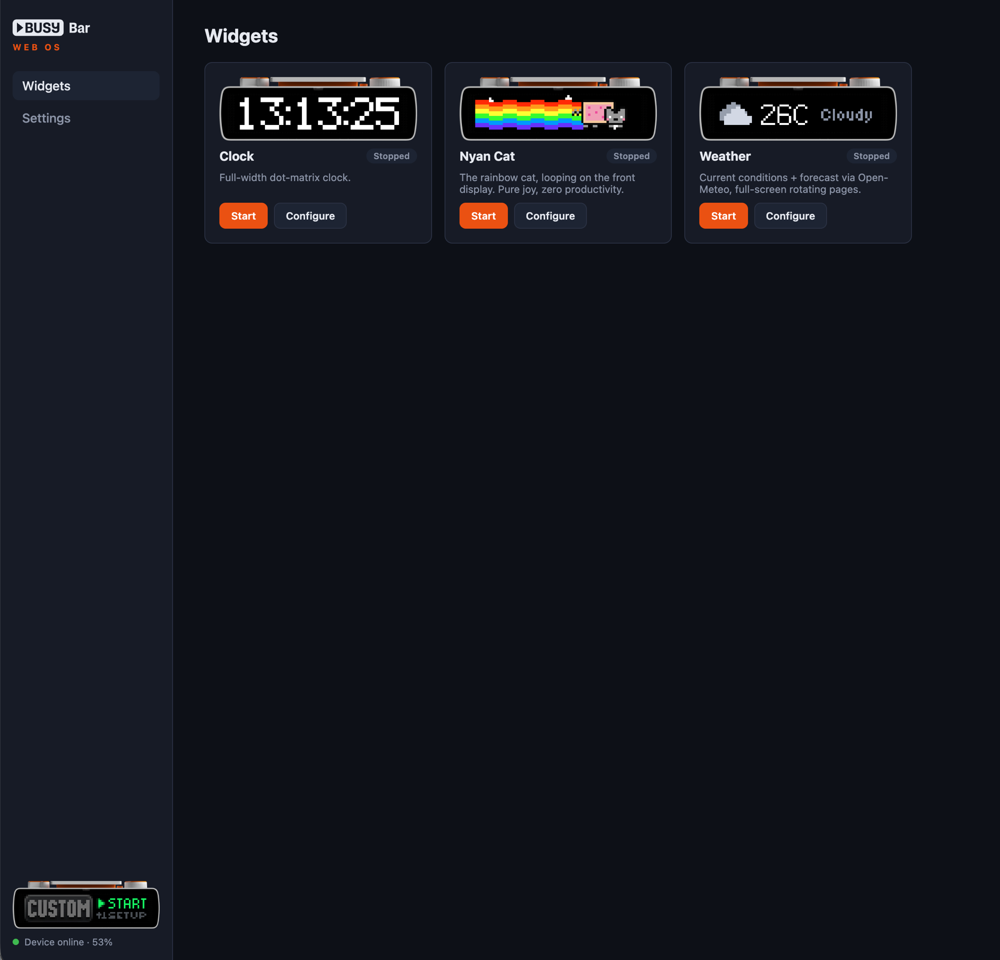

# BUSY Web OS

A TypeScript "OS" for the [BUSY Bar](https://busy.bar) device: a widget runtime + web portal backed by SQLite.



- **Widgets** live in `widgets/<id>/` as simple classes (`class WeatherWidget extends Widget`), can bundle images, and draw on the device displays.
- **Portal** (default `http://localhost:3000`): start/stop widgets, edit per-widget config, view per-widget logs, live screen preview.
- **Global settings**: device access over USB ethernet (`http://10.0.4.20`), Wi-Fi LAN (optional access key sent as `X-API-Token`), or the BUSY cloud (`https://api.busy.app`, Bearer token from [cloud.busy.app/api-tokens](https://cloud.busy.app/api-tokens)). First run shows an onboarding page until a connection is saved; the bar's Wi-Fi HTTP access (`/access`) is manageable from the portal.

## Getting started

```sh
pnpm install
pnpm dev        # dev server with reload
pnpm start      # plain start
pnpm typecheck  # tsc --noEmit
```

Data (SQLite DB) is stored in `data/busybar.db`, created automatically.

## Writing a widget

Create `widgets/my_widget/index.ts`:

```ts
import { Widget } from '../../src/core/widget';

export default class MyWidget extends Widget {
  static title = 'My Widget';
  static description = 'What it does.';
  static configSchema = {
    githubApiToken: { type: 'secret' as const, label: 'GitHub token', required: true },
    refreshMinutes: { type: 'number' as const, default: 5 },
  };

  async start() {
    // optional: push an image from widgets/my_widget/assets/ to the device
    await this.uploadAsset('icon.png');

    // run immediately, then every N ms; errors are logged, loop keeps going
    this.every(Number(this.config.refreshMinutes) * 60_000, () => this.refresh());
  }

  private async refresh() {
    this.log.info('refreshing…');
    await this.draw([
      { id: 'icon', type: 'image', path: 'icon.png', x: 0, y: 0, timeout: 0 },
      { id: 'label', type: 'text', text: 'Hello', font: 'normal', x: 18, y: 8, align: 'mid_left', timeout: 0 },
    ]);
  }

  async stop() {
    // timers are cleaned up and the display cleared automatically
  }
}
```

Restart the server (or let `pnpm dev` reload) to pick up new widgets.

### Widget API

| Member | Purpose |
| --- | --- |
| `this.config` | Effective config values (schema defaults + portal overrides) |
| `this.log` | Per-widget logger (`info/warn/error/debug`), visible in the portal |
| `this.every(ms, fn)` | Run `fn` now and on an interval; auto-cleaned on stop |
| `this.draw(elements, opts?)` | Draw on the device (`application_name` injected) |
| `this.clear()` | Clear this widget's display elements |
| `this.uploadAsset(name)` | Upload `widgets/<id>/assets/<name>` to the device |
| `this.bar` | Full `BusyBarClient` (audio, brightness, input, …) |

Config field types:

| Type | Portal input | Stored value |
| --- | --- | --- |
| `string` | text (optional `pattern` regex) | string |
| `secret` | masked text | string (plain text in SQLite) |
| `number` | number | number |
| `boolean` | checkbox | boolean |
| `color` | color picker | `#RRGGBBAA` (device format) |
| `location` | "use my location" + text fallback | `"lat,lon"` |

Mark fields `required: true` to block start until they're set. Values are validated server-side on save — an invalid value (bad color, malformed coordinates, regex mismatch…) returns 400 and nothing is stored.

### Preview image

Widget cards in the portal show a preview of the widget's rendering if the widget ships one. Accepted locations (first match wins, extensions png/bmp/jpg/webp):

- `widgets/<id>/preview.<ext>`
- `widgets/<id>/assets/preview.<ext>`
- `widgets/<id>/assets/<id>.<ext>` (e.g. `weather/assets/weather.bmp`)

Ideal ratio is 72:16 like the front display. No file, no preview.

The front display is 72×16 px; keep drawings small. See the device OpenAPI spec for all element types (text, image, animation, countdown, rectangle).

## HTTP API

The portal is a thin client over the server API:

- `GET /api/widgets`, `GET /api/widgets/:id`
- `POST /api/widgets/:id/start`, `POST /api/widgets/:id/stop`
- `PUT /api/widgets/:id/config`
- `GET /api/widgets/:id/logs?limit=100`
- `GET|PUT /api/settings`
- `GET /api/device/status`, `GET /api/device/screen?display=0|1`
- `POST /api/device/test` — probe a candidate connection (body: partial settings) without saving it
- `GET|POST /api/device/access` — the bar's Wi-Fi HTTP access setting (`{mode: disabled|enabled|key, key}`)
